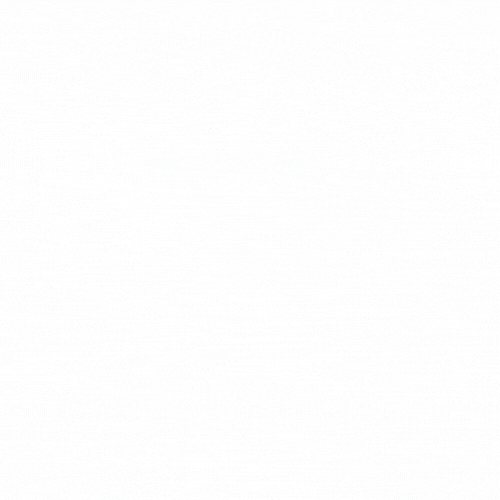

<a name="readme-top"></a>

<div align="center">
  <!-- You are encouraged to replace this logo with your own! Otherwise you can also remove it. -->
  
  <br/>

  <h3><b>CODE CANE</b></h3>

</div>

<!-- TABLE OF CONTENTS -->

# 📗 Table of Contents

- [📖 About the Project](#about-project)
  - [🛠 Built With](#built-with)
    - [Tech Stack](#tech-stack)
    - [Key Features](#key-features)
  - [🚀 Live Demo](#live-demo)
- [💻 Getting Started](#getting-started)
  - [Setup](#setup)
  - [Prerequisites](#prerequisites)
  - [Install](#install)
  - [Usage](#usage)
  - [Run tests](#run-tests)
  - [Deployment](#triangular_flag_on_post-deployment)
- [👥 Authors](#authors)
- [🔭 Future Features](#future-features)
- [🤝 Contributing](#contributing)
- [⭐️ Show your support](#support)
- [🙏 Acknowledgements](#acknowledgements)
- [📝 License](#license)

<!-- PROJECT DESCRIPTION -->

# 📖 Amon-Cofie's Portfolio<a name="about-project"></a>

This project is my porfolio design with which I talk about myself and my professional experience in programming. It features some of my personal projects and numerous means to get in touch with me.

## 🛠 Built With <a name="built-with"></a>

### Tech Stack <a name="tech-stack"></a>


<details>
  <summary>Client</summary>
  <ul>
    <li>HTML</li>
    <li>CSS</li>
    <li>JavaScript</li>
  </ul>
</details>

<!-- Features -->

### Key Features <a name="key-features"></a>

- **About me**
- **My personal projects**
- **Contact form**

<p align="right">(<a href="#readme-top">back to top</a>)</p>

<!-- LIVE DEMO -->

## 🚀 Live Demo <a name="live-demo"></a>


- [Live Demo Link](https://amon-cofie-portfolio.netlify.app/)

<p align="right">(<a href="#readme-top">back to top</a>)</p>

<!-- GETTING STARTED -->

## 💻 Getting Started <a name="getting-started"></a>

You can get this project cloned and modified to create a porfolio page of your own provided you give the appropriate acknowlegement. Here is how you do this.

### Prerequisites

In order to run this project you need:


```sh
- A code editor
- A web browser
- Node installed
- NPM installed
```
 

### Setup

Clone this repository to your desired folder.
First open or navigate to your desired folder.
Now open your terminal in this folder and run the following commands:


```sh
  git clone git@github.com:amon-cofie/amon-cofie-portfolio.git
  cd amon-cofie-portfolio  
```

You can open the current project folder in your code editor.
You can use the following command in your terminal if you are using vs code

```sh
  code .
```


### Install

Install the dependencies by running the command


```sh
  
  npm install
```


### Usage

You can start live server if you have the extension in vs code to open the project on your local server or you can open the index.html file with your web browser.


### Deployment

This project is deployed live on netlify 

<p align="right">(<a href="#readme-top">back to top</a>)</p>

<!-- AUTHORS -->

## 👥 Author <a name="authors"></a>


👤 **David Amon-Cofie**

- GitHub: [@amon-cofie](https://github.com/amon-cofie)
- Twitter: [@amon_cofie](https://twitter.com/amon_cofie)
- LinkedIn: [David Amon-Cofie](https://www.linkedin.com/in/amon-cofie/)

<p align="right">(<a href="#readme-top">back to top</a>)</p>

<!-- FUTURE FEATURES -->

## 🔭 Future Features <a name="future-features"></a>


- **3D animations on home section**
- **Add my certificates and qualifications**


<p align="right">(<a href="#readme-top">back to top</a>)</p>

<!-- CONTRIBUTING -->

## 🤝 Contributing <a name="contributing"></a>

Contributions, issues, and feature requests are welcome!

Feel free to check the [issues page](https://github.com/amon-cofie/amon-cofie-portfolio/issues).

<p align="right">(<a href="#readme-top">back to top</a>)</p>

<!-- SUPPORT -->

## ⭐️ Show your support <a name="support"></a>
If you like this project, please do give it a star!

<p align="right">(<a href="#readme-top">back to top</a>)</p>

<!-- ACKNOWLEDGEMENTS -->

## 🙏 Acknowledgments <a name="acknowledgements"></a>


I would like to thank [Codehal](https://www.youtube.com/@codehal) for the design inspiration on his youtube channel

<p align="right">(<a href="#readme-top">back to top</a>)</p>

<!-- LICENSE -->

## 📝 License <a name="license"></a>

This project is [MIT](./LICENSE) licensed.

<p align="right">(<a href="#readme-top">back to top</a>)</p>